# 介词：空间、位置、方向、时间

## 常见介词总览

除了上面的 on、in、at、by，初中常见的介词可以按画面分成五组。前四组都有空间或时间上的画面，每个配一幅简笔画；最后一组今天表示抽象关系，不配图，但它们本来也是空间或形状上的词。

| 组别 | 介词 | 共同点 |
| --- | --- | --- |
| 核心空间 | to、from、into、out of | 从哪里来、到哪里去、进去、出来 |
| 位置 | over、above、under、below、near、beside、between、among、behind、in front of | 一个东西在另一个东西的哪一边 |
| 方向 | across、through、along、around | 移动的路线 |
| 时间 | before、after、during、since、for、until | 事情发生在时间轴的哪一段 |
| 抽象关系 | of、for、with、without、about、like、except | 所属、目的、伴随、话题、相似、排除 |

**很多介词是拼出来的。** 把它们拆开，意思就写在字面上：

| 介词 | 拆开 | 字面意思 |
| --- | --- | --- |
| before | be-（旁边、在）+ fore（前面） | 在前面 |
| behind | be- + hind（后面） | 在后面 |
| beside | be- + side（侧面） | 在侧边 |
| between | be- + 一个表示“两个一组”的成分（和 two 同一个来源） | 在两个中间 |
| below | be- + low（低） | 在低处 |
| above | a-（在）+ be- + 一个表示“高处”的成分 | 在高处 |
| about | a-（在）+ be- + out（外面） | 在外面一圈 |
| across | a-（在）+ cross（十字） | 成十字交叉 |
| around | a-（在）+ round（圆） | 在圆圈上 |
| among | a-（在）+ 一个表示“混在一起”的成分（和 mingle 同一个来源） | 在人群当中 |
| into | in + to | 到里面去 |
| without | with + out | 在外面 |

表里的 be- 就是 by 不重读时的样子；a- 在这些词里是 on、in（在）弱读后的样子，above、ahead、aside 里的 a- 都是这样来的。

## 核心空间：to、from、into、out of

**这四个介词讲的是移动：to 是朝目标去，from 是从起点离开，into 是从外面进到里面，out of 是从里面出来。**

| 介词 | 本义 | 从本义怎么推出来 | 例句 |
| --- | --- | --- | --- |
| **to** | 朝着某处，一直到那里：朝……方向，一直到某地、某状态、某目标，和 from 相反 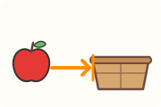 | 本义直接用：到某处 | I walked **to** the apple farm. 我走路去了苹果园。 |
| | | 东西朝一个人移过去，到了他手里，他就是接受者 | He gave an apple **to** his sister. 他把一个苹果给了他妹妹。 |
| | | 一直到 → 到了哪一头为止。from 是起点，to 是终点 | We pick apples from Monday **to** Friday. 我们周一到周五摘苹果。 |
| | | “还要走多远才到”，也就是“在……开始之前”：How long is it to lunch?（离午饭还有多久？）。five to ten 就是“还差五分钟到十点” | It's five **to** ten. 现在是九点五十五分。 |
| | | prefer 由 pre-（前面）和 fer（搬、放）组成，本义“放在前面”。to 可以引出比较的第二部分，比如 We won by six goals to three.（我们以六比三获胜）。prefer A to B 就是“把 A 放在前面，对比的另一方是 B”，句子里没有比较级，所以不用 than | I prefer apples **to** pears. 比起梨，我更喜欢苹果。 |
| **from** | 离开，从起点移开，空间上、时间上都可以 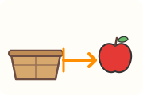 | 本义直接用：起点 | He walked home **from** the apple farm. 他从苹果园走回家。 |
| | | 离开的地方，就是来的地方：来源、产地 | These apples are **from** my grandpa's farm. 这些苹果来自爷爷的农场。 |
| | | 东西从谁那里出发：谁寄的、谁给的 | This box of apples is **from** my grandma. 这箱苹果是奶奶寄来的。 |
| | | 时间上的起点 | The fruit shop is open **from** 8 a.m. to 7 p.m. 水果店从早上八点开到晚上七点。 |
| | | different 由 dif-（分开）和 fer（搬）组成，本义“搬开、分开”。和谁分开，就用表示“离开”的 from | This apple is different **from** that one. 这个苹果和那个不一样。 |
| | | 离开原来的样子。from 可以表示变化之前的状态或形式（translating from English to Spanish 从英语译成西班牙语）。苹果变成了果汁，from 指出变化前的东西 | Apple juice is made **from** apples. 苹果汁是用苹果做的。 |
| **into** | 进到里面。它本来就是 in 和 to 两个词，合起来是为了区分“在房子里”和“进到房子里” 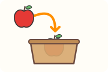 | 本义直接用：进入某处 | Put the apples **into** the basket. 把苹果放进篮子里。 |
| | | 朝一个东西“往里”冲，冲到碰上它为止 | The bike crashed **into** an apple tree. 自行车撞上了一棵苹果树。 |
| | | 进入一种新的样子，表示状态的变化（The fruit can be made into jam. 这种水果可以做成果酱） | The apples can be made **into** jam. 这些苹果可以做成果酱。 |
| | | 进入另一种语言 | Translate this sentence **into** English. 把这句话翻译成英语。 |
| **out of** | 从里面出来。out 表示从里面或中心向外的移动 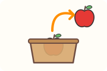 | 本义直接用：从里面出来 | She took an apple **out of** the basket. 她从篮子里拿出一个苹果。 |
| | | 从容器里出来，就是东西的出处，比如 He drank his beer out of the bottle.（他直接对着瓶子喝啤酒） | He drank apple juice **out of** the bottle. 他直接对着瓶子喝苹果汁。 |
| | | 走出某种状态。out of 既表示“不再处于某种状态”（out of sight 看不见了），也表示“什么都没有了”（We're out of milk. 我们没牛奶了）：苹果全“出去”了，我们也就出了“有苹果”的状态 | We're **out of** apples. 我们的苹果吃完了。 |
| | | 从一个数目或一组当中取出来 | Six **out of** ten apples were red. 十个苹果里有六个是红的。 |

into 表示“进去”这个移动，只说东西在哪儿用 in：The apples are in the basket. 苹果在篮子里。古时候 in 一个词兼管这两个意思，后来才分出 into 专管“进去”。

回家说 go home，不加 to，见第一部分“副词”。

**中考易错点：**
- be made from 和 be made of 都能译成“由……制成”，区别在介词本义上。from 指“变化之前的东西”：原料经过加工，已经看不出原来的样子（Apple juice is made from apples. 苹果汁是用苹果做的）。of 的本义是“出自、离开”（见后面“抽象关系”一节），能说明一个东西由什么构成，东西就是用这种材料搭起来的，一眼看得出（The basket is made of wood. 这个篮子是木头的）。再看两个例句：Wine is made from grapes.（葡萄酒是用葡萄酿的）；Traditional Japanese houses were made of wood.（传统的日本房屋是木头建的）。
- We're out of apples 不是“我们在苹果外面”，而是“苹果用完了”。

本义依据：[etymonline: a-](https://www.etymonline.com/word/a-)、[to](https://www.etymonline.com/word/to)、[from](https://www.etymonline.com/word/from)、[into](https://www.etymonline.com/word/into)、[out](https://www.etymonline.com/word/out)、[prefer](https://www.etymonline.com/word/prefer)、[different](https://www.etymonline.com/word/different)。用法依据：[剑桥英汉词典：to](https://dictionary.cambridge.org/zhs/%E8%AF%8D%E5%85%B8/%E8%8B%B1%E8%AF%AD/to)、[from](https://dictionary.cambridge.org/zhs/%E8%AF%8D%E5%85%B8/%E8%8B%B1%E8%AF%AD/from)、[into](https://dictionary.cambridge.org/zhs/%E8%AF%8D%E5%85%B8/%E8%8B%B1%E8%AF%AD/into)、[out of](https://dictionary.cambridge.org/zhs/%E8%AF%8D%E5%85%B8/%E8%8B%B1%E8%AF%AD/out-of)、[make](https://dictionary.cambridge.org/zhs/%E8%AF%8D%E5%85%B8/%E8%8B%B1%E8%AF%AD/make)；[Oxford Learner's: to](https://www.oxfordlearnersdictionaries.com/definition/english/to_1)、[from](https://www.oxfordlearnersdictionaries.com/definition/english/from)、[into](https://www.oxfordlearnersdictionaries.com/definition/english/into)、[out](https://www.oxfordlearnersdictionaries.com/definition/english/out_1)、[make](https://www.oxfordlearnersdictionaries.com/definition/english/make_1)、[of](https://www.oxfordlearnersdictionaries.com/definition/english/of)。

## 位置：over、above、under、below、near、beside、between、among、behind、in front of

**这一组说的是两个东西的相对位置：谁在上、谁在下、谁在旁边、谁在中间、谁在前后。**

| 介词 | 本义 | 从本义怎么推出来 | 例句 |
| --- | --- | --- | --- |
| **over** | 在上方，并且越过去。它很早就同时有“在上方、在上面、横过、越过、超过”这几个意思 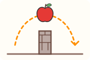 | 约 1400 年起有“盖住整个表面”的意思 | Put a cloth **over** the apples. 在苹果上盖一块布。 |
| | | 在正上方（不接触）。over 指垂直或接近垂直的上方 | There is a lamp **over** the table. 桌子上方挂着一盏灯。 |
| | | 从上面越过去 | He jumped **over** the apple basket. 他跳过了苹果筐。 |
| | | 越过一个数目 → 超过 | This apple tree is **over** fifty years old. 这棵苹果树有五十多年了。 |
| | | over 还有“从头到尾、贯穿整个范围”的意思，所以能表示“在……期间”：We'll discuss it over lunch.（我们吃午饭时再讨论）。聊天贯穿了整顿午饭 | We talked about the apple farm **over** lunch. 我们边吃午饭边聊苹果园的事。 |
| | | 盖住整个表面 → 到处都是。all over 是“在某处的全部或大部分地方” | There were apples all **over** the floor. 地上到处都是苹果。 |
| **above** | 在高处。由 a-（在）、be-（旁边）和一个表示“高处”的成分组成 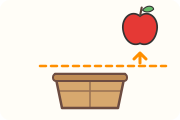 | 本义直接用：位置更高，不一定在正上方 | The apples hung **above** our heads. 苹果挂在我们头顶上方。 |
| | | 位置高 → 水平高。14 世纪末起有“（数量、重量、价值）更多”的意思 | This year's apple harvest is **above** average. 今年的苹果收成高于平均水平。 |
| **under** | 在下面，这个位置是相对于上面那个东西说的 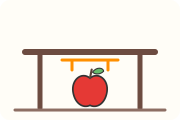 | 本义直接用：在下面 | The dog is sleeping **under** the apple tree. 狗在苹果树下睡觉。 |
| | | 位置低 → 数量低。14 世纪末起用于标准，表示“（年龄、价格、价值）少于” | These apples cost **under** ten yuan. 这些苹果不到十元。 |
| **below** | 在低处。由 be-（旁边）和 low（低）组成 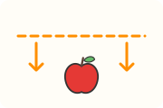 | 本义直接用：低于某个高度或某条线 | Write "apple" **below** the picture. 在图的下面写上 apple。 |
| | | 位置低 → 数量或水平低 | It was **below** zero last night. 昨晚气温在零度以下。 |
| **near** | 离得近。near 本来是“近”的比较级，意思是“更近”，后来当普通的“近”用 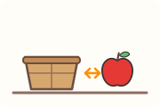 | 作介词时指“在空间或时间上接近”。空间上近 | We live **near** an apple farm. 我们住在一个苹果园附近。 |
| | | 时间上近 | My birthday is very **near** Christmas. 我的生日离圣诞节很近。 |
| **beside** | 在侧边。be- 加 side（侧面），字面是“在……的侧面” 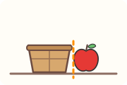 | 本义直接用：紧挨在旁边 | Tom sat **beside** me and ate an apple. 汤姆坐在我旁边吃苹果。 |
| | | 两样东西并排一放，大小就比出来了，所以 beside 能表示“和……相比”，比如 My painting looks childish beside yours.（和你的画一比，我的画显得很幼稚） | My apple looks small **beside** yours. 和你的苹果比，我的看起来很小。 |
| **between** | 在两个中间。be- 加一个表示“两个一组”的成分，和 two 同一个来源 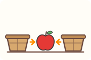 | 本义直接用：空间上在两者中间 | The apple is **between** the two baskets. 苹果在两个篮子中间。 |
| | | 时间轴上两个点的中间 | I often eat an apple **between** lunch and dinner. 我常在午饭和晚饭之间吃个苹果。 |
| | | 在两样东西中间选 | I had to choose **between** an apple and a pear. 我得在苹果和梨之间选一个。 |
| **among** | 在人群当中。a- 加一个表示“混在一起”的成分，字面是“在人群里” 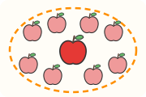 | 本义直接用：混在一群里、被围着 | There is a small house **among** the apple trees. 苹果树丛中有一座小房子。 |
| | | 混在一群里 → 是这一群里的一个，也就是包括在一群人或物里 | Apples are **among** my favourite fruits. 苹果是我最喜欢的水果之一。 |
| **behind** | 在后面。be- 加 hind（后面） 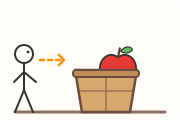 | 本义直接用：在后面 | There is an apple farm **behind** our school. 我们学校后面有个苹果园。 |
| | | 在后面 → 没跟上。约 1200 年起有“没那么先进、比不上”的比喻义 | He is **behind** the rest of the class in English. 他的英语落后于班上其他同学。 |
| **in front of** | 在前面。front 本义是“额头”，14 世纪中期起指“任何东西最前面的部分”。in front of 就是“在某物的额头那一面” 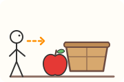 | 本义直接用：在某物前方不远处 | There is an apple tree **in front of** our house. 我们家房子前面有一棵苹果树。 |
| | | 在一个人脸的前面，他就看得见 → 当着某人的面做某事 | He ate the apple **in front of** everyone. 他当着大家的面吃了那个苹果。 |

over 和 above、between 和 among 都有交叉，放在后面的对比小节细讲。

under 和 below 都是“在下面”。below 是 above 的反面，比较两个各自独立的高度（below the line 在线下面）；under 是 over 的反面，讲一个东西压在或罩在另一个东西下面（under the table 在桌子底下）。

**中考易错点：**
- in front of 和 in the front of 的区别在 front 指的是谁的前部。in front of the house 是“在房子这张‘脸’的前方”，人在房子外面；the front of the bus 是“公交车自己最前面的那一部分”，at the front of 或 in the front of 就在车里面。例如：The driver sits at the front of the bus.（司机坐在公交车的最前面）；There's a bus stop in front of the house.（房子前面有个公交站）。
- beside 和 besides 只差一个 s。besides 是 beside 加了一个构成副词的 -s，以前两个词意思一样，后来分了工，现在 besides 主要表示“除……之外还有”：What other fruits do you like besides apples? 除了苹果，你还喜欢什么水果？在否定句里，besides 表示“除了……以外（没有别的）”：There was no fruit at home besides apples. 除了苹果，家里没有别的水果。

本义依据：[etymonline: over](https://www.etymonline.com/word/over)、[above](https://www.etymonline.com/word/above)、[under](https://www.etymonline.com/word/under)、[below](https://www.etymonline.com/word/below)、[near](https://www.etymonline.com/word/near)、[beside](https://www.etymonline.com/word/beside)、[besides](https://www.etymonline.com/word/besides)、[between](https://www.etymonline.com/word/between)、[among](https://www.etymonline.com/word/among)、[behind](https://www.etymonline.com/word/behind)、[front](https://www.etymonline.com/word/front)。用法依据：[剑桥英汉词典：over](https://dictionary.cambridge.org/zhs/%E8%AF%8D%E5%85%B8/%E8%8B%B1%E8%AF%AD/over)、[above](https://dictionary.cambridge.org/zhs/%E8%AF%8D%E5%85%B8/%E8%8B%B1%E8%AF%AD/above)、[under](https://dictionary.cambridge.org/zhs/%E8%AF%8D%E5%85%B8/%E8%8B%B1%E8%AF%AD/under)、[below](https://dictionary.cambridge.org/zhs/%E8%AF%8D%E5%85%B8/%E8%8B%B1%E8%AF%AD/below)、[near](https://dictionary.cambridge.org/zhs/%E8%AF%8D%E5%85%B8/%E8%8B%B1%E8%AF%AD/near)、[beside](https://dictionary.cambridge.org/zhs/%E8%AF%8D%E5%85%B8/%E8%8B%B1%E8%AF%AD/beside)、[besides](https://dictionary.cambridge.org/zhs/%E8%AF%8D%E5%85%B8/%E8%8B%B1%E8%AF%AD/besides)、[between](https://dictionary.cambridge.org/zhs/%E8%AF%8D%E5%85%B8/%E8%8B%B1%E8%AF%AD/between)、[among](https://dictionary.cambridge.org/zhs/%E8%AF%8D%E5%85%B8/%E8%8B%B1%E8%AF%AD/among)、[behind](https://dictionary.cambridge.org/zhs/%E8%AF%8D%E5%85%B8/%E8%8B%B1%E8%AF%AD/behind)、[in front of](https://dictionary.cambridge.org/zhs/%E8%AF%8D%E5%85%B8/%E8%8B%B1%E8%AF%AD/in-front-of)；[Oxford Learner's: over](https://www.oxfordlearnersdictionaries.com/definition/english/over_1)、[above](https://www.oxfordlearnersdictionaries.com/definition/english/above_1)、[under](https://www.oxfordlearnersdictionaries.com/definition/english/under_1)、[below](https://www.oxfordlearnersdictionaries.com/definition/english/below_2)、[near](https://www.oxfordlearnersdictionaries.com/definition/english/near_1)、[beside](https://www.oxfordlearnersdictionaries.com/definition/english/beside)、[besides](https://www.oxfordlearnersdictionaries.com/definition/english/besides_1)、[between](https://www.oxfordlearnersdictionaries.com/definition/english/between_1)、[among](https://www.oxfordlearnersdictionaries.com/definition/english/among)、[behind](https://www.oxfordlearnersdictionaries.com/definition/english/behind_1)、[front](https://www.oxfordlearnersdictionaries.com/definition/english/front_1)。

## 方向：across、through、along、around

**这一组说的是移动的路线：横着过去、从中间穿过去、顺着走、绕着转。**

| 介词 | 本义 | 从本义怎么推出来 | 例句 |
| --- | --- | --- | --- |
| **across** | 横着交叉过去。a- 加 cross（十字），它最早指“成十字形、交叉着”，14 世纪初起指“从一边到另一边” 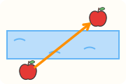 | 横着越过一个平面或一条线：从一边到另一边 | We walked **across** the street to the fruit shop. 我们穿过马路去水果店。 |
| | | 越过去以后就在另一边。1750 年起有“在另一边（越过之后的位置）”的意思 | There is a fruit shop **across** the street. 街对面有一家水果店。 |
| **through** | 从一头进去，从另一头出来：从一边或一端到另一边或另一端 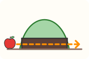 | 本义直接用：从中间穿过 | The apple truck went **through** the tunnel. 运苹果的卡车穿过了隧道。 |
| | | 视线穿过一个东西，从另一边看到、听到 | I saw the apple tree **through** the window. 我透过窗户看到了那棵苹果树。 |
| | | 穿过一条通道才到达另一头 → 经由某个途径达到结果，也就是“通过、由于”：You can only achieve success through hard work.（只有努力才能取得成功） | You can only succeed **through** hard work. 只有努力才能成功。 |
| **along** | 顺着长的一面。由一个表示“对着”的前缀和 long（长）组成，作介词时指“顺着……的整个长度” 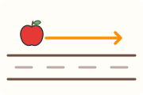 | 本义直接用：顺着长的东西走 | We walked **along** the road and saw many apple trees. 我们沿着路走，看到了很多苹果树。 |
| | | 顺着长边排成一线 | There are apple trees **along** the river. 河边一路都是苹果树。 |
| **around** | 在圆圈上。a- 加 round（圆），意思是“绕一圈、在四周” 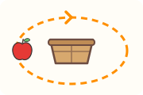 | 围在四周 | We sat **around** the table and ate apples. 我们围坐在桌子旁吃苹果。 |
| | | 绕过去 → 到了另一边：Our house is just around the corner.（我们家就在拐角那边） | The fruit shop is just **around** the corner. 水果店就在拐角那边。 |
| | | 本义直接用：绕一圈 | They walked **around** the lake. 他们绕着湖走了一圈。 |
| | | 在一个地方转来转去 → 到处走，走遍一个区域里的许多地方 | We walked **around** the apple farm. 我们在苹果园里四处走了走。 |

**中考易错点：** across 和 through 都能译成“穿过”，但画面不同，见后面的对比小节。

本义依据：[etymonline: across](https://www.etymonline.com/word/across)、[through](https://www.etymonline.com/word/through)、[along](https://www.etymonline.com/word/along)、[around](https://www.etymonline.com/word/around)。用法依据：[剑桥英汉词典：across](https://dictionary.cambridge.org/zhs/%E8%AF%8D%E5%85%B8/%E8%8B%B1%E8%AF%AD/across)、[through](https://dictionary.cambridge.org/zhs/%E8%AF%8D%E5%85%B8/%E8%8B%B1%E8%AF%AD/through)、[along](https://dictionary.cambridge.org/zhs/%E8%AF%8D%E5%85%B8/%E8%8B%B1%E8%AF%AD/along)、[around](https://dictionary.cambridge.org/zhs/%E8%AF%8D%E5%85%B8/%E8%8B%B1%E8%AF%AD/around)；[Oxford Learner's: across](https://www.oxfordlearnersdictionaries.com/definition/english/across_1)、[through](https://www.oxfordlearnersdictionaries.com/definition/english/through_1)、[along](https://www.oxfordlearnersdictionaries.com/definition/english/along_1)、[around](https://www.oxfordlearnersdictionaries.com/definition/english/around_1)。

## 时间：before、after、during、since、for、until

**这一组把事情放到时间轴上：在某个时间点之前或之后、在一段时间之内、从某时一直到现在、持续多久、一直到某个时间点为止。** 图里的横线是时间轴，箭头指向将来。

| 介词 | 本义 | 从本义怎么推出来 | 例句 |
| --- | --- | --- | --- |
| **before** | 在前面。be- 加 fore（前面），它一开始就既指位置在前，也指时间在前 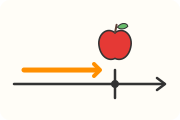 | 空间上在前面 → 时间上在前面 | I always eat an apple **before** breakfast. 我总是在早饭前吃个苹果。 |
| | | 排队排在前面：顺序在前 | Your name is **before** mine on the list. 名单上你的名字在我前面。 |
| | | 在昨天前面的那一天：the day before yesterday 里的 before 就是“早于” | We picked apples the day **before** yesterday. 我们前天摘了苹果。 |
| **after** | 更靠后、离得更远。after 由 of（离开，即今天的 off）加一个比较级后缀组成，本义“更远离”；作介词最早就有“在后面、时间上晚于、跟在后面追”的意思 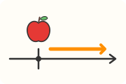 | 更靠后 → 时间上在后面 | We picked apples **after** lunch. 午饭后我们去摘了苹果。 |
| | | 顺序在后 | Your name comes **after** mine on the list. 名单上你的名字在我后面。 |
| | | 在后面紧跟着，想追上。after 早期就有“追赶，跟着想要赶上”的意思 | The dog ran **after** the apple. 狗追着苹果跑。 |
| | | 在明天后面的那一天 | We will pick apples the day **after** tomorrow. 我们后天去摘苹果。 |
| **during** | 在……持续的时候。during 是一个表示“持续、延续”的旧动词加 -ing，during the day 就是“在这一天持续的时候” 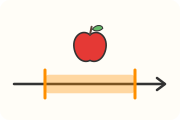 | 在这段时间持续的整个过程里 | Don't eat apples **during** class. 上课时不要吃苹果。 |
| | | 在这段时间持续的过程里，某个时候发生了一件事 | The apple fell **during** the night. 苹果是夜里掉下来的。 |
| **since** | 在那之后。since 最早由“之后”和“那”两部分合成，意思是“在那以后” 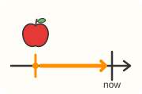 | 从那个时间点以后，一直延续到现在。所以说的是“到现在为止”的情况 | I haven't eaten an apple **since** breakfast. 从早饭到现在我还没吃过苹果。 |
| | | 同上，后面跟一个过去的时间点 | We have lived near the apple farm **since** 2020. 我们从 2020 年起就住在苹果园附近。 |
| **for** | for 很早就有“一直到……那么远”“在……期间”的意思 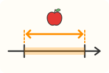 | 一直延伸那么远 → 说明有多长。for 既能表示一段距离（The road went on for miles. 那条路延伸了好几英里），也能表示一段时长：路有多长，时间就有多长 | We stayed on the apple farm **for** three days. 我们在苹果园待了三天。 |
| **until** | 一直到。until 由表示“一直到”的 un- 和表示“到”的 till 组成，两部分意思相同 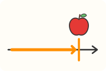 | 动作一直持续，到这个时间点才停 | We picked apples **until** six o'clock. 我们一直摘苹果摘到六点。 |
| | | 否定句里，持续的是“没有做”：一直没吃，到午饭时才吃。比如 You're not going out until you've finished this.（这个不做完你就别出去） | I didn't eat the apple **until** lunchtime. 我直到午饭时才吃那个苹果。 |

before、after、since、until 也能当连词，后面接一个句子：Wash the apple before you eat it. 吃苹果前先洗一洗。这些连词用法在第四部分“状语从句”里讲。

**中考易错点：**
- during 回答“什么时候”，for 回答“多长时间”，从本义就分得开：during 是“在那段时间持续的时候”，指出事情落在哪一段；for 是“延伸那么远”，量出有多长。要说 I stayed in London for a week.（我在伦敦待了一个星期），不说 I stayed in London during a week。
- since 后面接时间点（since breakfast、since 2020），for 后面接一段时长（for three days）。since 本来是“在那之后”，后面自然要跟“那个”起点；for 量的是长度。两者常和现在完成时连用，详见第五部分“现在完成时的 for 与 since”。

本义依据：[etymonline: before](https://www.etymonline.com/word/before)、[after](https://www.etymonline.com/word/after)、[during](https://www.etymonline.com/word/during)、[since](https://www.etymonline.com/word/since)、[for](https://www.etymonline.com/word/for)、[until](https://www.etymonline.com/word/until)。用法依据：[剑桥英汉词典：before](https://dictionary.cambridge.org/zhs/%E8%AF%8D%E5%85%B8/%E8%8B%B1%E8%AF%AD/before)、[after](https://dictionary.cambridge.org/zhs/%E8%AF%8D%E5%85%B8/%E8%8B%B1%E8%AF%AD/after)、[during](https://dictionary.cambridge.org/zhs/%E8%AF%8D%E5%85%B8/%E8%8B%B1%E8%AF%AD/during)、[since](https://dictionary.cambridge.org/zhs/%E8%AF%8D%E5%85%B8/%E8%8B%B1%E8%AF%AD/since)、[for](https://dictionary.cambridge.org/zhs/%E8%AF%8D%E5%85%B8/%E8%8B%B1%E8%AF%AD/for)、[until](https://dictionary.cambridge.org/zhs/%E8%AF%8D%E5%85%B8/%E8%8B%B1%E8%AF%AD/until)；[Oxford Learner's: before](https://www.oxfordlearnersdictionaries.com/definition/english/before_1)、[after](https://www.oxfordlearnersdictionaries.com/definition/english/after_1)、[during](https://www.oxfordlearnersdictionaries.com/definition/english/during)、[since](https://www.oxfordlearnersdictionaries.com/definition/english/since_1)、[for](https://www.oxfordlearnersdictionaries.com/definition/english/for_1)、[until](https://www.oxfordlearnersdictionaries.com/definition/english/until_1)。
