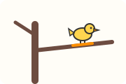
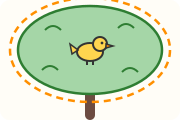
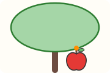
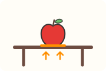
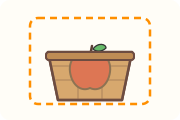
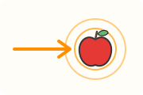
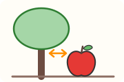

# 介词：先记住一幅空间画面

**每个介词都有一个空间上的本义，多数用法都能从这个画面一步步推出来。** 下面每个用法都按“本义 → 引申 → 用法”来写。

先看一组对比：

| 例句 | 画面 |
| --- | --- |
| The bird is **on** the branch. 鸟站在树枝上。 | 鸟站在树枝表面，和树枝接触  |
| The bird is **in** the tree. 鸟在树上。 | 树冠是一个有枝有叶的空间，鸟在这个空间里。鸟在树洞里也用 in  |
| The apple is **on** the tree. 苹果长在树上。 | 苹果挂在树上，和树连在一起  |

**英语的说法：** 鸟在树上，英语通常说 in the tree，例如 Birds were singing in the trees.（鸟儿在树上唱歌。）长在树上的苹果和叶子用 on the tree。落在某一根树枝上，用 on the branch。

这个区别正好能从本义看出来：in 是“被一个空间包围”，树冠是一团枝叶，鸟钻在里面；on 是“贴着表面、被它托住”，苹果长在树枝上，树枝托着它。

用法依据：[Oxford Learner's: bird](https://www.oxfordlearnersdictionaries.com/definition/english/bird)。

## on、in、at、by 对照表

| 介词 | 本义 | 从本义怎么推出来 | 例句 |
| --- | --- | --- | --- |
| **on** | 贴在表面上，被它托住。on 的第一个意思就是“在上面并且接触”和“处在被它托住的位置”  | 本义直接用：在表面上 | There is an apple **on** the table. 桌上有一个苹果。 |
| | | 接触表面就算，不一定在上方：侧面、贴着的都行：on 表示“覆盖、接触某个表面”，比如 a picture on a wall（墙上的一幅画） | There is a sticker **on** the apple. 苹果上贴着一张标签。 |
| | | 被托住 → 靠它撑着 → 取决于它。on 既表示“被……托住”，也表示“以……为基础”（a story based on fact 根据事实写的故事） | The apple harvest depends **on** the weather. 苹果收成取决于天气。 |
| | | on 还表示“动作指向的目标”：钱“落”到了哪样东西上 | He spent ten yuan **on** apples. 他花十元买苹果。 |
| | | on 的意思里还有“关于、涉及” | a book **on** apples 一本关于苹果的书 |
| | | 某一天，见后面“时间 in、on、at”一节 | We buy apples **on** Sundays. 我们周日买苹果。 |
| **in** | 在里面，被包围：在某物的形状之内，被它包围  | 本义直接用：在容器或区域里 | The apples are **in** the basket. 苹果在篮子里。 |
| | | 被四面包住 | There is a worm **in** this apple! 这个苹果里有条虫！ |
| | | 把一段时间看成一个范围，事情落在这个范围里面。in 很早就有“在……期间”的意思 | Apples are cheap **in** October. 十月的苹果很便宜。 |
| | | 在里面 → 处在某种形式、状态里。in 既能表示“用某种语言、材料”，也能表示“处于某种状态、形式”（She wrote in pencil. 她用铅笔写的）。话“装在”英语这种形式里说出来 | How do you say "苹果" **in** English? 苹果用英语怎么说？ |
| **at** | 到、靠近某一点。本义是“到、靠近、在”，只指出位置，不管这个地方有多大  | 把一个地点当作一个点：在哪儿发生 | I bought apples **at** the market. 我在市场买了苹果。 |
| | | 时间轴上的一个点 | I eat an apple **at** 7 o'clock. 我七点吃一个苹果。 |
| | | 本义里就有“到、朝着”：目光朝着那个点 | Look **at** the apple! 看那个苹果！ |
| | | 擅长哪一项：at 用在形容词后面，说一个人某件事做得怎么样。at 后面指出的是“在哪一件事上” | I'm good **at** drawing apples. 我擅长画苹果。 |
| **by** | 在旁边、靠近。本义是“在近处、在旁边”，最早是一个表示地点的小词  | 本义直接用：在旁边 | There is a house **by** the apple tree. 苹果树旁边有座房子。 |
| | | 靠近 → 经过 → 走哪条路 → 用哪种方式。by 能表示“经过”（He walked by me. 他从我身边走过）；by the way（顺便说一句）字面意思是“沿着这条路”；travel by air/land/sea（走空路、陆路、海路）说的正是走哪条路 | We went to the apple farm **by** bus. 我们坐公交去了苹果园。 |
| | | 被谁做：by 通常用在被动动词后面，说明是谁或什么做了这件事。被动句先说东西怎么了，再用 by 补出是谁干的 | The apple was eaten **by** Tom. 苹果被汤姆吃了。 |
| | | 不晚于所说的时间，常说“到那时事情已经办完”（I'll have it done by tomorrow. 我明天之前把它做好） | Please pick the apples **by** Friday. 请在周五之前把苹果摘完。 |

**中考易错点：**
- by bus 里 bus 前面没有冠词；on 后面的交通工具要带冠词或物主代词（on the bus、on a bus、on my bike）。by 说的是“用哪种方式”：travel by boat/bus/car/plane（坐船、坐公交、坐车、坐飞机旅行）后面都不加冠词，说的是交通方式，不是哪一辆车。on 是“被托住”：人在车上，由车载着（He was on the plane. 他在飞机上），说的是具体那一辆，所以要加 the。
- by 和 until 都能译成“到……为止”，但意思不同。by Friday 是“最晚到周五，事情要做完”；until 是“动作一直持续到那个时刻”（见后面时间一节）。

本义依据：[etymonline: on](https://www.etymonline.com/word/on)、[in](https://www.etymonline.com/word/in)、[at](https://www.etymonline.com/word/at)、[by](https://www.etymonline.com/word/by)。用法依据：[剑桥英汉词典：on](https://dictionary.cambridge.org/zhs/%E8%AF%8D%E5%85%B8/%E8%8B%B1%E8%AF%AD/on)、[in](https://dictionary.cambridge.org/zhs/%E8%AF%8D%E5%85%B8/%E8%8B%B1%E8%AF%AD/in)；[Oxford Learner's: on](https://www.oxfordlearnersdictionaries.com/definition/english/on_1)、[in](https://www.oxfordlearnersdictionaries.com/definition/english/in_1)、[at](https://www.oxfordlearnersdictionaries.com/definition/english/at)、[by](https://www.oxfordlearnersdictionaries.com/definition/english/by_1)。
