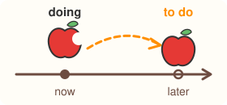

# 非谓语形式：to do 与 doing

## 动词的非谓语形式

非谓语形式长得像动词，但不当谓语。它们有三种：to eat、eating 和 eaten。

**非谓语形式不随主语和时间变化。** 名称已经说明了这一点：不定式 infinitive 本义是“不受限制的”，不受人称和数限制。谓语动词要看主语和时态变形（I eat、he eats、he ate），非谓语形式不变。

| 形式 | 样子 | 名称或词尾的本义 | 在句子里当什么 | 例句 |
| --- | --- | --- | --- | --- |
| 不定式 | to eat | infinitive：“不受限制的”；to：“朝向、为了” | 宾语、目的、修饰名词 | I went to the market **to buy** apples. 我去市场买苹果。 |
| 动名词 | eating | 把动词变成名词的 -ing，表示“这个动作” | 名词能当的成分：主语、宾语、介词后面 | **Eating** apples is good for you. 吃苹果对你有好处。 |
| 现在分词 | eating | 构成现在分词的 -ing，当形容词用 | 修饰名词，表示正在做、主动做 | The boy **eating** an apple is my brother. 正在吃苹果的那个男孩是我弟弟。 |
| 过去分词 | eaten | -ed、-en 标志“动作已经完成” | 修饰名词，表示被做、已完成 | The apple **eaten** by the boy was sweet. 被男孩吃掉的那个苹果很甜。 |

**1．不定式 to do**

不定式由 to 加动词原形构成。介词 to 的本义是“朝向、一直到（某个地方、状态、目标）”，也有“为了”的意思。不定式前的 to 就是从这种用法来的；到今天，很多不定式里的 to 已经只是个标记，本身没有意思。不过下面几种常见用法，“朝向目标”的意思还看得出来：

- **作宾语，表示想做、打算做的事：** 心思朝着一个还没做的动作。I want **to eat** an apple. 我想吃一个苹果。哪些动词接 to do，见下一节。
- **表示目的：** 爬树是为了摘苹果，to 就是“为了”。He climbed the tree **to pick** apples. 他爬上树去摘苹果。
- **放在名词或 something 这类词后面，说明它：** something to eat 就是“用来吃的东西”，东西指向“吃”这个用途。Would you like something **to eat**? 你想吃点东西吗？
- **疑问词 + to do：** how to pick 是“怎样去摘”，问的是一件要去做的事。Can you show me how **to pick** apples? 你能教我怎么摘苹果吗？

情态动词、助动词 do 后面接不带 to 的原形，原因见前面“四类动词总览”。make、let 后面也接不带 to 的原形，句型是 let somebody do something 和 make somebody do something：Let me **eat** the apple. 让我吃这个苹果。She always makes me **laugh**. 她总能把我逗笑。

**2．动名词 doing**

英语里有一个 -ing 专门“把动词变成名词，表示这个动作”。所以动名词就是一个名词，名词能放的位置它都能放。

- **作主语：** **Picking** apples is fun. 摘苹果很好玩。主语是“摘苹果”这一件事，所以谓语用单数 is。
- **作宾语：** I enjoy **eating** apples. 我喜欢吃苹果。
- **放在介词后面：** 介词后面要跟名词，动词要变成名词才能放进去。I'm good at **drawing** apples. 我擅长画苹果。

**3．分词的基础用法**

分词的英文名 participle 本义是“分享”，指它兼有动词和形容词两种性质。所以分词除了构成时态和被动语态，还能像形容词一样修饰名词。两种分词的差别来自词尾：

| 分词 | 词尾的本义 → 意思 | 例句 |
| --- | --- | --- |
| 现在分词 -ing | 构成现在分词的 -ing，常当形容词用 → 名词自己正在做这件事 | Look at the boy **picking** apples. 看那个正在摘苹果的男孩。 |
| 过去分词 -ed、-en | 及物动词的过去分词 → 名词是承受动作的一方；不及物动词没有承受者，-ed 标志的“动作已经完成”就显出来了 | The apple **eaten** by the boy was sweet. 被男孩吃掉的那个苹果很甜。（及物：被吃掉） We picked up the **fallen** apples. 我们把掉在地上的苹果捡了起来。（不及物：已经掉下来的） |

interested 和 interesting 这类词已经是形容词，见第一部分“形容词”。

**中考易错点：** 介词后面要跟名词，所以介词后面的动词用 -ing 形式。2024 年河南卷语篇填空第 57 题 made a living by **selling** fried dough sticks（靠卖油条谋生），考的就是这一点。

本义依据：[etymonline: infinitive](https://www.etymonline.com/word/infinitive)、[to](https://www.etymonline.com/word/to)、[gerund](https://www.etymonline.com/word/gerund)、[-ing](https://www.etymonline.com/word/-ing)、[participle](https://www.etymonline.com/word/participle)、[-ed](https://www.etymonline.com/word/-ed)。
用法依据：[剑桥英汉词典：infinitive](https://dictionary.cambridge.org/zhs/%E8%AF%8D%E5%85%B8/%E8%8B%B1%E8%AF%AD/infinitive)、[gerund](https://dictionary.cambridge.org/zhs/%E8%AF%8D%E5%85%B8/%E8%8B%B1%E8%AF%AD/gerund)、[participle](https://dictionary.cambridge.org/zhs/%E8%AF%8D%E5%85%B8/%E8%8B%B1%E8%AF%AD/participle)、[eat](https://dictionary.cambridge.org/zhs/%E8%AF%8D%E5%85%B8/%E8%8B%B1%E8%AF%AD/eat)、[fall](https://dictionary.cambridge.org/zhs/%E8%AF%8D%E5%85%B8/%E8%8B%B1%E8%AF%AD/fall)；[牛津学习词典：let](https://www.oxfordlearnersdictionaries.com/definition/english/let_1)、[make](https://www.oxfordlearnersdictionaries.com/definition/english/make_1)。

## 动词后面接 to do 还是 doing

**规律：to do 指向还没发生的动作，doing 指动作本身。** 这条规律来自两个词尾的本义：to 是“朝向、为了”；把动词变成名词的 -ing 表示“这个动作”。它是一种倾向，不是绝对规则，但初中常见的动词都能用它解释。关键是先看清动词本身的意思：主语是不是要“朝着”那个动作去做。

- **to do：动作还在前方。** 主语的心思朝着一个还没做的动作：计划、愿望、决定要去做的事。
- **doing：动作本身。** 这个动作正在发生、已经发生过，或者被当成一件事来谈论、考虑、躲开。

下表把四类动词放在一起。第三类看上去“指向将来”，其实这些动词的本义不是“朝着去做”，而是把动作当成一件事来处理，所以接 doing。最后三行最能检验规律：同一个动词接 to do 和接 doing，意思恰好对应“还没做”和“动作本身”。

| 类型 | 动词和它的意思 | 接 to do：还没做 | 接 doing：动作本身 |
| --- | --- | --- | --- |
| 心思朝着要做的事，接 to do | want（想要）、hope（希望）、decide（决定）、plan（计划） | I **decided to eat** an apple. 我决定吃一个苹果。 | 不能接 |
| 对付的就是动作本身，接 doing | enjoy：en- 是“使”，加上 joy，“从中得到快乐”。快乐来自正在做的事 finish：结束一件正在做的事 practise：为了学会而反复做 keep：继续做下去 | 不能接 | I **enjoy eating** apples. 我喜欢吃苹果。 |
| 把动作当成一件事来想、来提、来躲，接 doing | suggest：把一个想法摆到别人面前让人考虑。建议的人自己不一定去做，他提出的是“吃苹果”这个主意 consider：仔细考虑一件事 imagine：在脑子里形成一幅画面 mind：对一件事感到不快、介意 avoid：避开、离……远远的 | 不能接 | I **suggest eating** an apple every day. 我建议每天吃一个苹果。 |
| | look forward to：look forward 是“盼望”，to 是介词，指向盼望的那件事。介词后面要跟名词，所以接 doing | 不能接 | I'm **looking forward to picking** apples next week. 我盼着下周去摘苹果。 |
| 两种都接，意思不同 | remember：记着 | Remember **to buy** apples. 记得去买苹果。（记着一件还没做的事） | I remember **buying** apples. 我记得买过苹果。（脑子里有做这件事的画面） |
| | forget：本义是“得到”的反面，从脑子里丢掉 | Don't forget **to wash** the apple. 别忘了洗苹果。（丢掉一件该做的事） | I'll never forget **eating** that apple. 我永远忘不了吃那个苹果的情景。（丢不掉一段经历） |
| | stop：本义是“堵住”，让它停下 | He stopped **to eat** an apple. 他停下手里的事，去吃苹果。（to 是“为了”） | He stopped **eating** apples. 他不再吃苹果了。（停下的就是“吃”本身） |

所以 avoid、consider、enjoy、finish、imagine、mind、practise、suggest 这些动词接 doing，因为它们对付的是动作本身；decide、hope、want 接 to do，因为它们指向一个还没发生的目标。

remember 的两种用法要分清：I remember posting the letter 的意思是“我脑子里有寄信的画面”，I remembered to post the letter 的意思是“我没忘记去寄”。

**中考易错点：** stop to do 里的 to do 是“停下来是为了去做”，原来的事被打断了。stop doing 是把正在做的这件事停掉。suggest 后面不接 to do：建议的人只是把一个主意摆出来，并不是自己朝着这件事去做。

本义依据：[etymonline: to](https://www.etymonline.com/word/to)、[-ing](https://www.etymonline.com/word/-ing)、[enjoy](https://www.etymonline.com/word/enjoy)、[suggest](https://www.etymonline.com/word/suggest)、[avoid](https://www.etymonline.com/word/avoid)、[imagine](https://www.etymonline.com/word/imagine)、[consider](https://www.etymonline.com/word/consider)、[practice](https://www.etymonline.com/word/practice)、[keep](https://www.etymonline.com/word/keep)、[remember](https://www.etymonline.com/word/remember)、[forget](https://www.etymonline.com/word/forget)、[stop](https://www.etymonline.com/word/stop)、[look](https://www.etymonline.com/word/look)。
用法依据：[剑桥英汉词典：remember](https://dictionary.cambridge.org/zhs/%E8%AF%8D%E5%85%B8/%E8%8B%B1%E8%AF%AD/remember)、[forget](https://dictionary.cambridge.org/zhs/%E8%AF%8D%E5%85%B8/%E8%8B%B1%E8%AF%AD/forget)、[stop](https://dictionary.cambridge.org/zhs/%E8%AF%8D%E5%85%B8/%E8%8B%B1%E8%AF%AD/stop)、[enjoy](https://dictionary.cambridge.org/zhs/%E8%AF%8D%E5%85%B8/%E8%8B%B1%E8%AF%AD/enjoy)、[finish](https://dictionary.cambridge.org/zhs/%E8%AF%8D%E5%85%B8/%E8%8B%B1%E8%AF%AD/finish)、[practise](https://dictionary.cambridge.org/zhs/%E8%AF%8D%E5%85%B8/%E8%8B%B1%E8%AF%AD/practise)、[keep](https://dictionary.cambridge.org/zhs/%E8%AF%8D%E5%85%B8/%E8%8B%B1%E8%AF%AD/keep)、[decide](https://dictionary.cambridge.org/zhs/%E8%AF%8D%E5%85%B8/%E8%8B%B1%E8%AF%AD/decide)、[suggest](https://dictionary.cambridge.org/zhs/%E8%AF%8D%E5%85%B8/%E8%8B%B1%E8%AF%AD/suggest)、[consider](https://dictionary.cambridge.org/zhs/%E8%AF%8D%E5%85%B8/%E8%8B%B1%E8%AF%AD/consider)、[imagine](https://dictionary.cambridge.org/zhs/%E8%AF%8D%E5%85%B8/%E8%8B%B1%E8%AF%AD/imagine)、[mind](https://dictionary.cambridge.org/zhs/%E8%AF%8D%E5%85%B8/%E8%8B%B1%E8%AF%AD/mind)、[avoid](https://dictionary.cambridge.org/zhs/%E8%AF%8D%E5%85%B8/%E8%8B%B1%E8%AF%AD/avoid)、[look forward to](https://dictionary.cambridge.org/zhs/%E8%AF%8D%E5%85%B8/%E8%8B%B1%E8%AF%AD/look-forward-to)；[牛津学习词典：suggest](https://www.oxfordlearnersdictionaries.com/definition/english/suggest_1)、[consider](https://www.oxfordlearnersdictionaries.com/definition/english/consider)、[imagine](https://www.oxfordlearnersdictionaries.com/definition/english/imagine)、[mind](https://www.oxfordlearnersdictionaries.com/definition/english/mind_2)、[avoid](https://www.oxfordlearnersdictionaries.com/definition/english/avoid)、[enjoy](https://www.oxfordlearnersdictionaries.com/definition/english/enjoy)、[finish](https://www.oxfordlearnersdictionaries.com/definition/english/finish_1)、[keep](https://www.oxfordlearnersdictionaries.com/definition/english/keep_1)、[remember](https://www.oxfordlearnersdictionaries.com/definition/english/remember)、[forget](https://www.oxfordlearnersdictionaries.com/definition/english/forget)、[stop](https://www.oxfordlearnersdictionaries.com/definition/english/stop_1)、[look forward to](https://www.oxfordlearnersdictionaries.com/definition/english/look-forward-to)。

**try、begin、start 也能接两种形式。** try 接 to do 和接 doing 意思不同；begin 和 start 两种都接，意思基本一样。

- **try** 本义是“把好的挑出来”，由此有了“检验、试验”，14 世纪起又有“尝试、努力”。朝着一个目标努力，用 to do；把一个办法真的拿来试一试、检验效果，就是拿动作本身来检验，用 doing。这是两个不同的义项：“尝试、努力去做或得到”和“用一用、做一做、试一试，看看好不好”。
- **begin、start** 说的都是“开头”。start 本义是“跳起、突然动起来”，1821 年起指“开始行动”，不再带“突然”的意思。开头既可以看成“朝着这个动作迈出第一步”，也可以看成“这个动作本身开始了”，两个角度说的是同一件事，所以接 to do 和 doing 意思基本一样。

| 动词 | 接 to do | 接 doing |
| --- | --- | --- |
| try | 努力去做，想办法做到：I **tried to reach** the apple, but it was too high. 我想够那个苹果，可是太高了。 | 试着做一下，看看行不行：**Try putting** the apples in the fridge. 试试把苹果放进冰箱。 |
| begin | 开始做：The apples **began to turn** red. 苹果开始变红了。 | 开始做：We **began picking** apples at eight. 我们八点开始摘苹果。 |
| start | 开始做：It **started to rain** while we were picking apples. 我们正摘苹果时，开始下雨了。 | 开始做：The children **started laughing**. 孩子们笑了起来。 |

**中考易错点：** try to do 是“尽力做”，事情朝着目标去，不一定做成。try doing 是真的去做一下，看看效果好不好。

本义依据：[etymonline: try](https://www.etymonline.com/word/try)、[begin](https://www.etymonline.com/word/begin)、[start](https://www.etymonline.com/word/start)。
用法依据：[剑桥英汉词典：try](https://dictionary.cambridge.org/zhs/%E8%AF%8D%E5%85%B8/%E8%8B%B1%E8%AF%AD/try)、[begin](https://dictionary.cambridge.org/zhs/%E8%AF%8D%E5%85%B8/%E8%8B%B1%E8%AF%AD/begin)、[start](https://dictionary.cambridge.org/zhs/%E8%AF%8D%E5%85%B8/%E8%8B%B1%E8%AF%AD/start)；[牛津学习词典：try](https://www.oxfordlearnersdictionaries.com/definition/english/try_1)。
