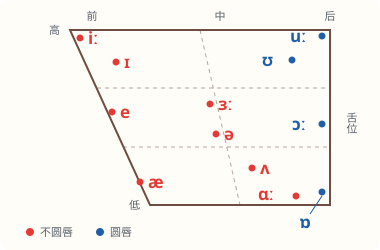

# 元音：单元音和双元音

**元音是气流从喉咙出来、一路不受阻挡发出的音。** 发元音时声带振动，舌头和嘴唇只改变口腔的形状，不挡住气流。每个音节都有一个元音，重读也落在元音上：apple /ˈæpl/ 的重读就在 /æ/ 上。英语一共有 20 个元音：12 个单元音，8 个双元音。

网页版里，点音标或例词后面的“英”“美”可以听录音。英式和美式读法相同的音，两种录音都可以听；读法不同的，音标一栏写成“英式, 美式”，和课本词表的写法一样。

## 单元音：舌头的位置决定音

单元音发音时，舌头和嘴唇从头到尾不动。决定是哪个音的，主要是两件事：

- **舌头哪一部分抬起来：** 舌前部、舌中部还是舌后部，下图从左到右。
- **抬得多高：** 抬得越高，嘴张得越小，下图从上到下。

嘴唇圆不圆是第三件事：舌后部的元音大多要把嘴唇收圆。

| 音标 | 口型和舌位 | 例词 |
| --- | --- | --- |
| /iː/ [英](audio:uk/iː) [美](audio:us/iː) | 舌前部抬得最高，嘴角向两边展开，像在微笑，声音拉长 | sheep /ʃiːp/ [英](audio:uk/iː/word) [美](audio:us/iː/word) eat /iːt/ |
| /ɪ/ [英](audio:uk/ɪ) [美](audio:us/ɪ) | 舌位比 /iː/ 稍低、稍靠后，嘴唇放松，短促 | ship /ʃɪp/ [英](audio:uk/ɪ/word) [美](audio:us/ɪ/word) pick /pɪk/ |
| /e/ [英](audio:uk/e) [美](audio:us/e) | 舌前部抬到一半，嘴比 /ɪ/ 张大一点 | head /hed/ [英](audio:uk/e/word) [美](audio:us/e/word) red /red/ |
| /æ/ [英](audio:uk/æ) [美](audio:us/æ) | 嘴张大，舌前部压低，嘴角稍向两边拉 | hat /hæt/ [英](audio:uk/æ/word) [美](audio:us/æ/word) apple /ˈæpl/ |
| /ɜː/, /ɜːr/ [英](audio:uk/ɜː) [美](audio:us/ɜːr) | 舌头平放在口腔中间，嘴唇半开、不圆，声音拉长；美式同时把舌尖卷起来，带出 r | bird /bɜː(r)d/ [英](audio:uk/ɜː/word) [美](audio:us/ɜːr/word) girl /ɡɜː(r)l/ |
| /ə/ [英](audio:uk/ə) [美](audio:us/ə) | 舌头完全放松，停在中间，嘴微微张开；最轻最短，只出现在不重读的音节里 | above /əˈbʌv/ [英](audio:uk/ə/word) [美](audio:us/ə/word) banana /bəˈnɑːnə/ |
| /ʌ/ [英](audio:uk/ʌ) [美](audio:us/ʌ) | 嘴半开，舌中部稍稍抬起，短而有力 | cup /kʌp/ [英](audio:uk/ʌ/word) [美](audio:us/ʌ/word) bus /bʌs/ |
| /ɑː/ [英](audio:uk/ɑː) [美](audio:us/ɑː) | 嘴张到最大，舌后部压低，声音拉长 | father /ˈfɑːðə(r)/ [英](audio:uk/ɑː/word) [美](audio:us/ɑː/word) class /klɑːs/ |
| /ɒ/, /ɑː/ [英](audio:uk/ɒ) | 嘴张大，嘴唇稍圆，舌后部压低，短促；美式读成 /ɑː/，嘴唇不圆 | sock /sɒk/, /sɑːk/ [英](audio:uk/ɒ/word) hot /hɒt/, /hɑːt/ |
| /ɔː/ [英](audio:uk/ɔː) [美](audio:us/ɔː) | 嘴唇收圆向前突，舌后部稍稍抬起，声音拉长 | horse /hɔː(r)s/ [英](audio:uk/ɔː/word) [美](audio:us/ɔː/word) four /fɔː(r)/ |
| /ʊ/ [英](audio:uk/ʊ) [美](audio:us/ʊ) | 嘴唇稍圆，舌后部抬起，放松，短促 | foot /fʊt/ [英](audio:uk/ʊ/word) [美](audio:us/ʊ/word) book /bʊk/ |
| /uː/ [英](audio:uk/uː) [美](audio:us/uː) | 嘴唇收圆向前突，舌后部抬得最高，声音拉长 | blue /bluː/ [英](audio:uk/uː/word) [美](audio:us/uː/word) food /fuːd/ |

**音标里的 (r)：** bird /bɜː(r)d/、horse /hɔː(r)s/、four /fɔː(r)/ 里的 (r) 表示英式不读这个 r，美式要读。所以 bird 英式读 /bɜːd/，美式读 /bɜːrd/。课本词表都是这样标的。

## 长元音和短元音：不只是长短不同

带 ː 的是长元音，不带的是短元音。/iː/ 和 /ɪ/、/uː/ 和 /ʊ/、/ɔː/ 和 /ɒ/、/ɜː/ 和 /ə/、/ɑː/ 和 /ʌ/ 常被放在一起对比，但每一对的差别**不只是拖不拖长**，舌头的位置也不一样。在舌位图上看，/iː/ 在最高最靠前的角上，/ɪ/ 比它低一点、往里一点。只把 /ɪ/ 拖长，并不会变成 /iː/。

| 长元音 | 短元音 | 对比 |
| --- | --- | --- |
| sheep /ʃiːp/ 绵羊 [英](audio:uk/iː/word) | ship /ʃɪp/ 船 [英](audio:uk/ɪ/word) | /iː/ 嘴角展开、舌位高；/ɪ/ 嘴唇放松、舌位低一点 |
| leave /liːv/ 离开 | live /lɪv/ 居住 | 同上。读错了意思就变了 |
| food /fuːd/ 食物 | foot /fʊt/ 脚 | /uː/ 嘴唇收圆突出；/ʊ/ 嘴唇稍圆、放松 |
| horse /hɔː(r)s/ 马 | hot /hɒt/ 热的 | /ɔː/ 嘴唇更圆、舌位稍高；/ɒ/ 嘴张得更大 |

## 双元音：从一个音滑到另一个音

双元音由两个单元音连成，发音时舌头和嘴唇从第一个音**滑向**第二个音。第一个音读得清楚响亮，第二个音轻而短，只表示滑去的方向。

| 音标 | 从哪个音滑到哪个音 | 例词 |
| --- | --- | --- |
| /eɪ/ [英](audio:uk/eɪ) [美](audio:us/eɪ) | 从 /e/ 滑向 /ɪ/ | day /deɪ/ [英](audio:uk/eɪ/word) [美](audio:us/eɪ/word) name /neɪm/ |
| /aɪ/ [英](audio:uk/aɪ) [美](audio:us/aɪ) | 从嘴张大的 /a/ 滑向 /ɪ/ | eye /aɪ/ [英](audio:uk/aɪ/word) [美](audio:us/aɪ/word) like /laɪk/ |
| /ɔɪ/ [英](audio:uk/ɔɪ) [美](audio:us/ɔɪ) | 从圆唇的 /ɔ/ 滑向 /ɪ/ | boy /bɔɪ/ [英](audio:uk/ɔɪ/word) [美](audio:us/ɔɪ/word) toy /tɔɪ/ |
| /əʊ/, /oʊ/ [英](audio:uk/əʊ) [美](audio:us/oʊ) | 英式从 /ə/ 滑向 /ʊ/；美式从圆唇的 /o/ 滑向 /ʊ/ | nose /nəʊz/, /noʊz/ [英](audio:uk/əʊ/word) [美](audio:us/oʊ/word) go /ɡəʊ/, /ɡoʊ/ |
| /aʊ/ [英](audio:uk/aʊ) [美](audio:us/aʊ) | 从嘴张大的 /a/ 滑向 /ʊ/，嘴唇渐渐收圆 | mouth /maʊθ/ [英](audio:uk/aʊ/word) [美](audio:us/aʊ/word) now /naʊ/ |
| /ɪə/, /ɪr/ [英](audio:uk/ɪə) | 英式从 /ɪ/ 滑向 /ə/；美式读 /ɪ/ 再带出 r | 英 ear /ɪə(r)/ [英](audio:uk/ɪə/word) 美 near /nɪr/ [美](audio:us/ɪr/word) |
| /eə/, /er/ [英](audio:uk/eə) | 英式从 /e/ 滑向 /ə/；美式读 /e/ 再带出 r | hair /heə(r)/, /her/ [英](audio:uk/eə/word) [美](audio:us/er/word) pear /peə(r)/, /per/ |
| /ʊə/, /ʊr/ [英](audio:uk/ʊə) | 英式从 /ʊ/ 滑向 /ə/；美式读 /ʊ/ 再带出 r | 英 pure /pjʊə(r)/ [英](audio:uk/ʊə/word) 美 tour /tʊr/ [美](audio:us/ʊr/word) |

最后三个双元音，美式都不再滑向 /ə/，而是读完前一个音直接带出 r。课本词表遇到这种情况会把美式单独写出来，比如 fair /feə(r)/, /fer/，因为这里英美不只差一个 r，元音也变了。

**补充：** 有的音标表还列出 /aɪə/（fire [英](audio:uk/aɪə/word)）和 /aʊə/（hour [英](audio:uk/aʊə/word)）两个“三合元音”。它们就是双元音 /aɪ/、/aʊ/ 后面接一个 /ə/，会读双元音就会读，一般不单独算作音素。

**中考易错点：**

- 同一组字母可以读成不同的元音，要看音标，不能按字母猜：ea 在 eat /iːt/ 里读 /iː/，在 head /hed/ 里读 /e/，在 great /ɡreɪt/ 里读 /eɪ/。
- 长短元音读错，就成了另一个词：leave /liːv/（离开）和 live /lɪv/（居住），sheep（绵羊）和 ship（船）。

音标写法依据：人教版初中英语教材词表（英式在前，美式在后）。
