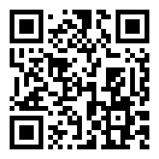
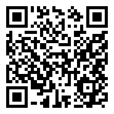
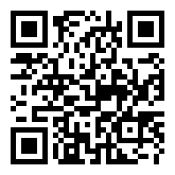
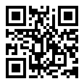

# 学习工具

下面是编写本导览时查过的网站。手机扫二维码就能打开。

| 标题 | 说明 | 网址 | 二维码 |
| --- | --- | --- | --- |
| 剑桥词典（英汉） | 查单词的意思、读音和例句，释义有中文。还标出名词可数不可数、动词及物不及物。本导览每节末尾的“用法依据”都链接到这里 | [dictionary.cambridge.org/zhs](https://dictionary.cambridge.org/zhs/) |  |
| 剑桥英语语法 | 按话题讲语法，比如冠词、反意疑问句、主谓一致，每条都有例句 | [dictionary.cambridge.org/zhs/语法/英式语法](https://dictionary.cambridge.org/zhs/%E8%AF%AD%E6%B3%95/%E8%8B%B1%E5%BC%8F%E8%AF%AD%E6%B3%95/) |  |
| 牛津高阶学习词典 | 英英词典，义项分得细，例句多。还列出一个词后面接什么，比如 suggest 后面接 doing | [oxfordlearnersdictionaries.com](https://www.oxfordlearnersdictionaries.com/) |  |
| Etymonline 在线词源词典 | 查一个词由哪几部分组成、本义是什么，是词源法记单词的主要工具。英文网站 | [etymonline.com](https://www.etymonline.com/) |  |
| OpenEtymology | 把单词拆成词根、前缀、后缀，每部分附中文意思，还有例句 | [openetymology.com](https://openetymology.com/) |  |
| 中考网 | 历年各省中考真题和答案，附录的试卷原文和 2022、2023 年答案来自这里 | [zhongkao.com](https://www.zhongkao.com/) |  |
