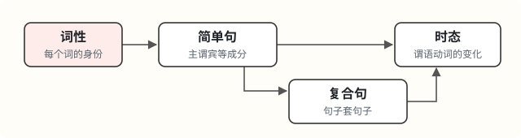

# 初三英语学习导览：词性、句子与时态

> 面向河南中考的初三学生。

## 导读：英语就是“词 → 句 → 复合句 → 时态”

英语的所有语法，都在回答四个问题：**这个词是什么？这句话谁做了什么？几句话怎么连在一起？事情发生在什么时候、处于什么状态？** 这份导览按这四个问题排出四个语法部分：第一部分词性、第三部分简单句、第四部分复合句、第五部分时态，建议按顺序学。第二部分词源法是记单词的工具，可以穿插着学。

词性决定一个词能在句子里当什么成分。成分组成简单句。简单句互相连接、嵌套，就成了复合句。时态只改一个地方：**谓语动词**。

### 贯穿全文的口诀

**一个简单句，只有一套主谓结构。**

**出现第二套主谓结构，就是复合句或并列句，中间一定有连词或引导词。但引导词有时可以省略，最常见的是宾语从句的 that 和定语从句里作宾语的 that、which、who，看不到不等于没有。**

数的是“主谓结构”，不是“动词”。下表后三行最容易判错：一个是两个动词共用一个主语，另外两个是引导词被省略。

| 句子 | 主谓结构 | 结论 |
| --- | --- | --- |
| I **eat** an apple. 我吃一个苹果。 | I eat | 一套，是简单句 |
| I think **that** apples are sweet. 我觉得苹果是甜的。 | I think / apples are | 两套，靠 that 连接，是复合句 |
| I **washed and ate** the apple. 我洗了苹果并吃掉了。 | I washed and ate | 一套。两个动词共用主语 I，叫并列谓语，**仍是简单句** |
| I think apples are sweet. 我觉得苹果是甜的。 | I think / apples are | 两套。that 省略了，**仍是复合句** |
| The apple I ate was sweet. 我吃的那个苹果很甜。 | the apple was / I ate | 两套。定语从句里作宾语的 that 省略了，**仍是复合句** |
